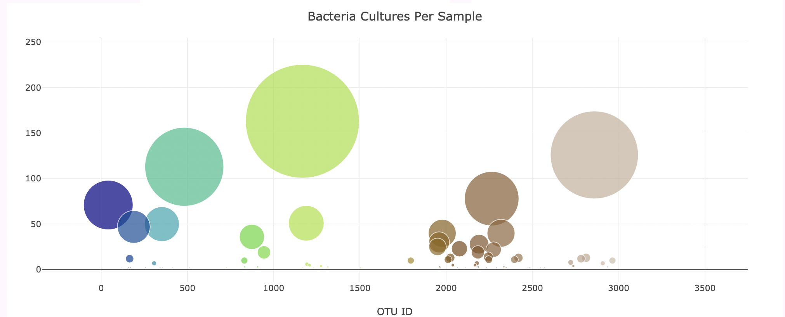

# Belly Button BioDiversity Dashboard

## Overview
The purpose of this project is to provide a dashboard to read and display information about the biodiversity of bactaria found in test subjects belly buttons.

## How it works
The website is created using HTML, CSS, Javascript specifically Bootstrap, D3 and Plotly.js.

To use this site select a Test Subject ID No. from the dropdown menu below.

The website will update and you will be able to visualize the bacterial data and demographics of the Test Subjects who provided bacteria samples from their belly buttons. Specifically, you can identify the top 10 bacterial species, the frequency the volunteer washes their belly button and the bacteria cultures per sample.

The reason this site would exist is because bacterial species have the ability to synthesize proteins that taste like beef and Improbable Beef wants to manufacture synthetic beef this dashboard can be used by Test Subjects to identify whether a species found in their navel is one Improbable Beef is using in their product.

## Results
In addition to the bar chart, guage and bubble chart, three additional changes were made to the website.  This included a background image for the jumbotron, a background color for the site and a short paragraph on the reason the site existed and what it provides.  
 
  
